# 使用邮件服务器作为cs服务端
## 1. 为什么要用邮件作为CS的服务端

互联网中有很多免费的邮件服务，例如qq邮箱，163邮箱，outlook邮箱
这些邮件提供商拥有大量的客户，这些邮件服务器通常会被认为是可信服务器，
甚至有的网络环境中只允许和邮件服务器进行通信。使用邮件服务器作为c2
可以很好的隐藏流量特征。同理可以使用oss存储对象，数据库等任意一个
可以进行写入和读取数据的地方都可以传输c2流量，这种方式被称为[c3](https://dodcio.defense.gov/Portals/0/Documents/DoD-C3-Strategy.pdf)。
以下是GPT的解释。
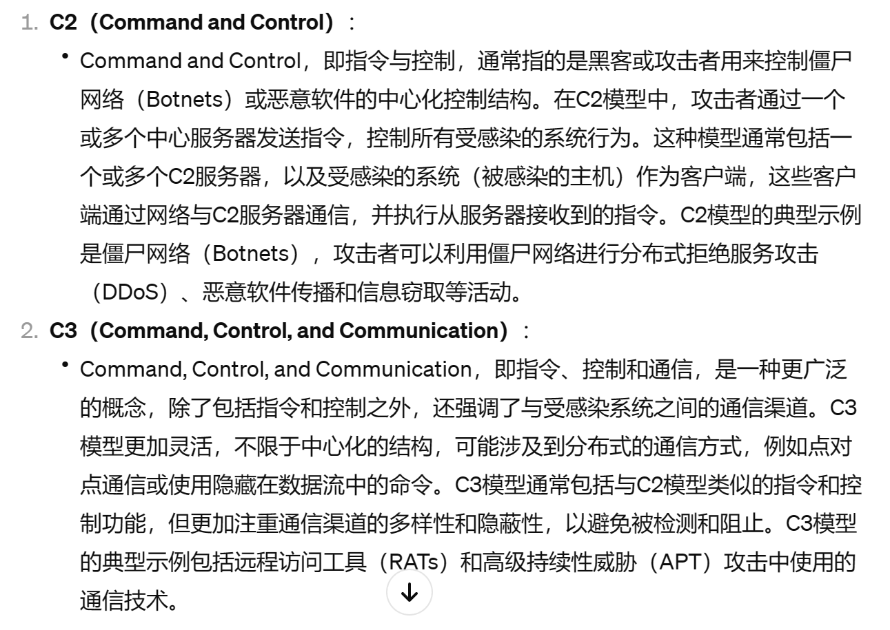

## 2. 使用邮件服务器作为C3的优点

- 使用可信服务器进行通信
- 防守难以从流量层面防护
- 无需云公网ip作为服务器
- 增强c2的隐私性

## 3. 使用邮件服务器作为C3的缺点

- 邮件延迟较高
- 账号容易被封号
- 需要编写专门的代码
- 邮箱账号密码容易泄露

## 4. 开始干活

有能力的可以从c2开始写，这样就只需要在木马端运行一个程序。
下面使用的是cs作为c2，将cs的流量嵌套进邮件中。
### 4.1 先上截图
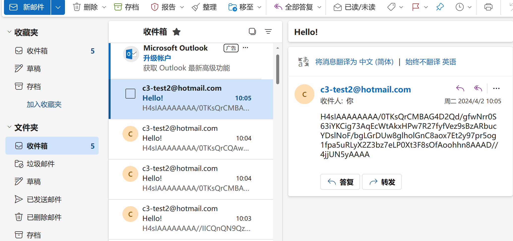
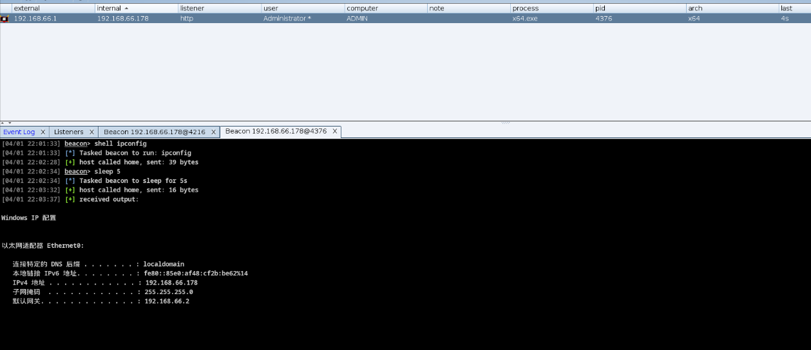

### 4.2 准备工作

需要准备两个邮箱账号，分别用来与木马和teamsever通信。
可以使用qq邮箱或者163邮箱等，但是请注意有封号的风险。
我使用的是两个新注册outlook邮箱。如果使用的qq等邮箱
需要开启smtp和imap服务，outlook默认已开启。

### 4.3 与木马端进行通信

需要考虑几个问题。
* 邮件通信有延迟，cs心跳是否需要，如果心跳保留就会发送大量邮件，邮件空间能怎么处理。 

针对这cs心跳我选择了保留，sleep时间设置长一点。如果只保留post请求也是可以的
这样会少很多邮件数据，但是不能清理teamserver，否则就
需要手动去邮件服务器中发送上线邮件，而且第一个get上线请求必须保留。
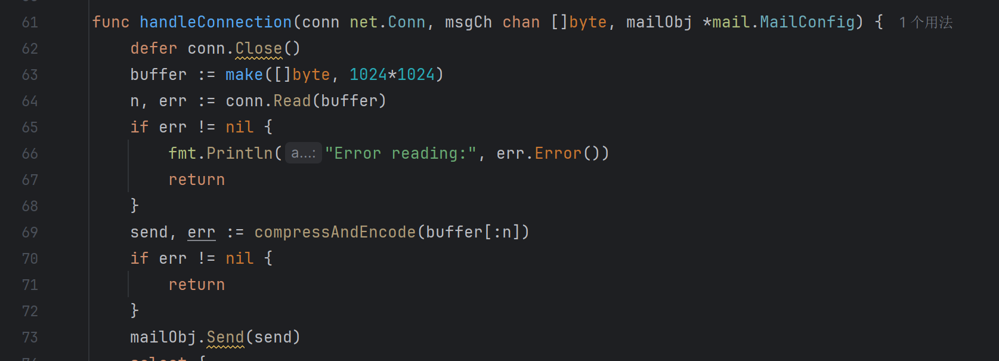
由于邮件服务器存在延迟且检查新邮件也有轮询时间，为了cs马不一直等待
我默认返回一个http响应。所以来自teamsever的数据在cs马的下一个请求被读取。
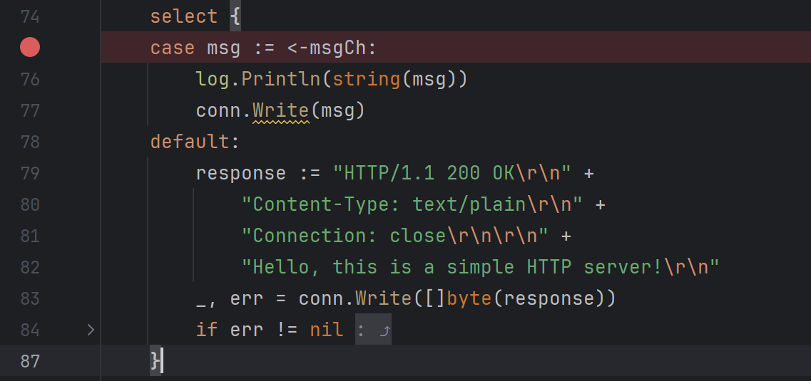
* 使用什么方式从邮件服务器中读取和发送邮件。

我选择了smtp和imap直接读取邮件，可以使用爬虫从网页中爬取，这样就不需要开启smtp也不需要处理不同邮件服务器的邮件格式。

发送邮件使用了gomail
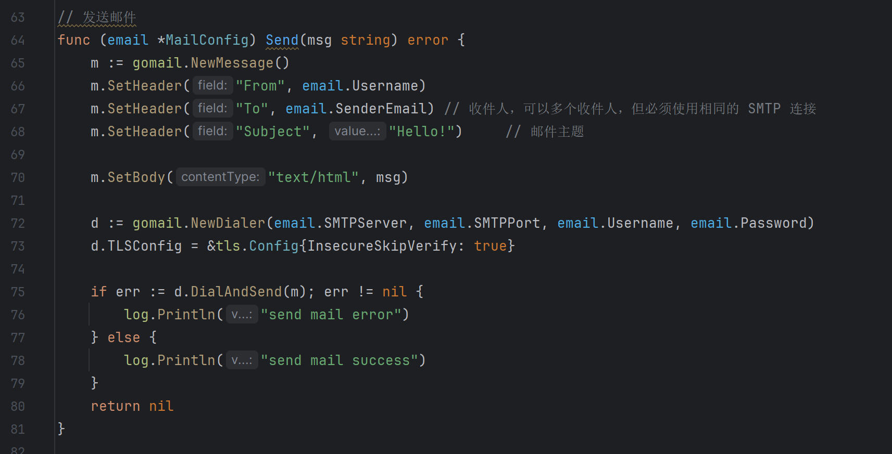
通过邮件数量判断是否有新邮件
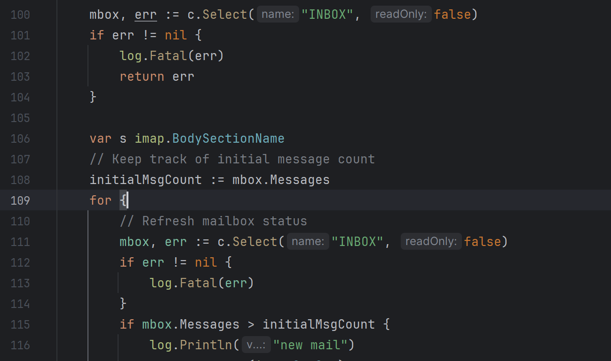
需要判断邮件的来源，并且不同的邮件服务器收到的邮件格式不一样，这里删除了邮件的
前67个字符是因为outlook会在邮件头添加一串字符。其他邮件服务器的邮件格式会有所不同（qq会有两次邮件，text和html两种格式）。
同时对数据包进行了压缩后base64编码，如果不编码会导致部分数据错乱。
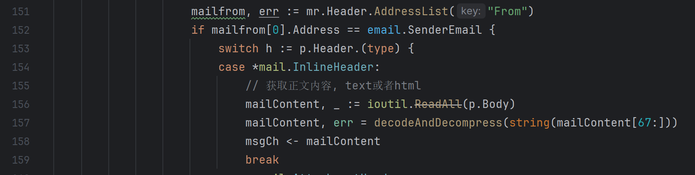

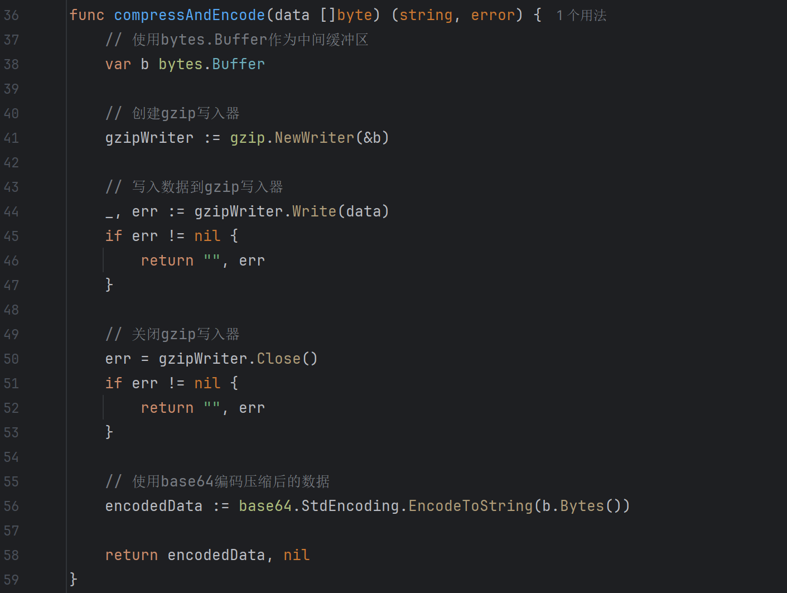
* 多个客户端如何处理

teamsever发送邮件的时候如何区分发给哪个邮箱，此处并未实现，所以和一个客户端进行通信。

* 最后就是如何接受cs马发送的数据

为了体积小和方便我直接使用了接受数据，这就意味着不支持https的监听器。
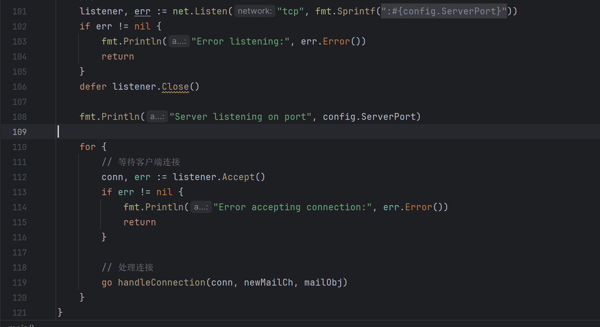

### 4.3 与teamsever进行通信

* 通信方式
同样使用的是tcp请求，只不过这次需要for循环来维持与teamsever的通信。
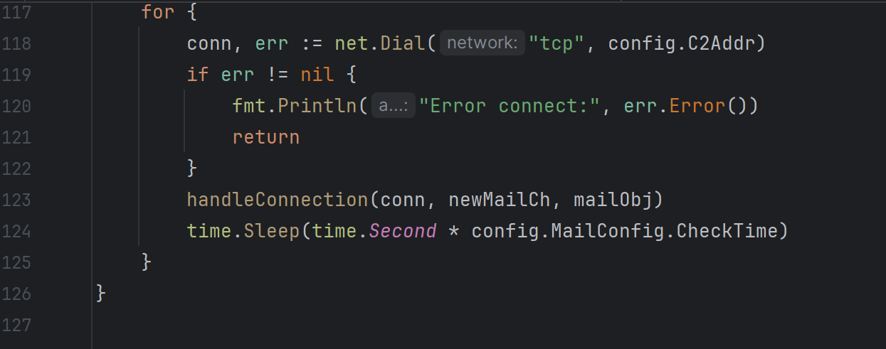

* 其他内容

发送邮件基本和木马端一致，但是发送来自cs马的流量后记得sleep一点时间，不然
teamserver只会返回http的响应头
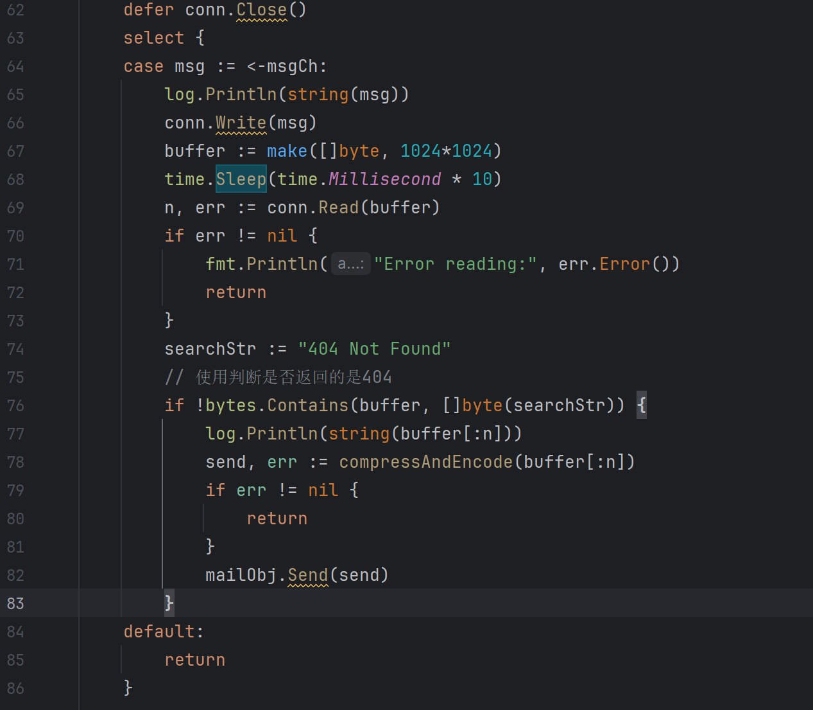

## 4. 完整代码

https://github.com/djhons/mail-c3

## 5. cs监听器配置

监听器的ip需要指向C3Mail，同时需要修改C3Mail中的ini配置文件和C3Mail-server中的配置文件。在里面添加上账号密码以及监听的端口等。
